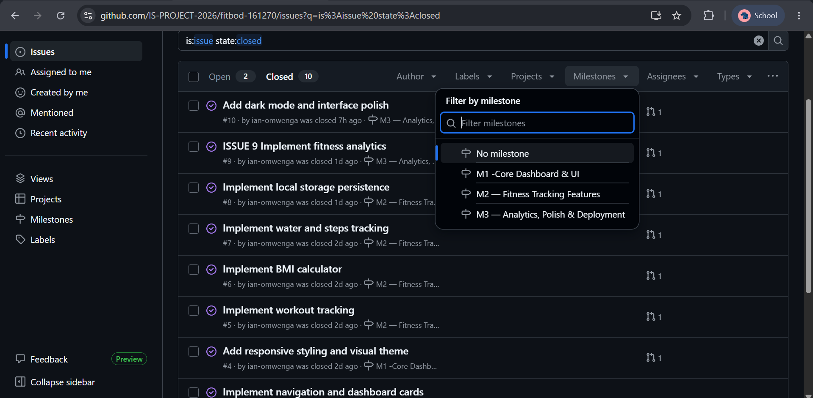
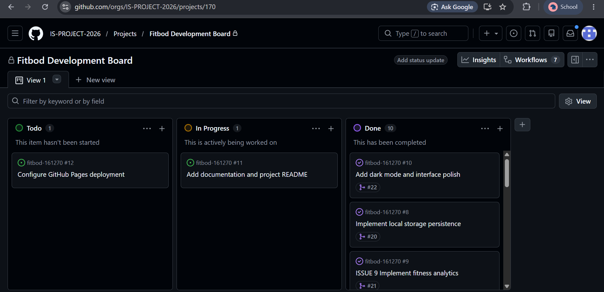
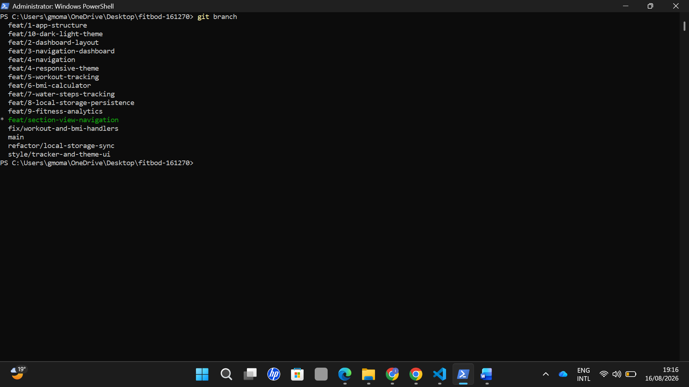
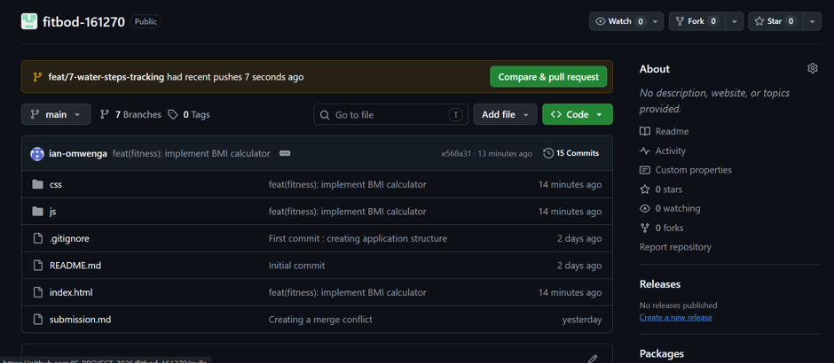
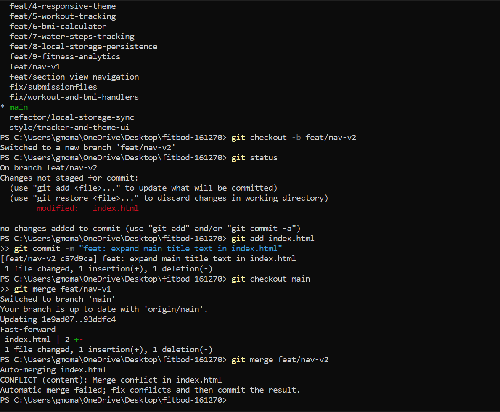
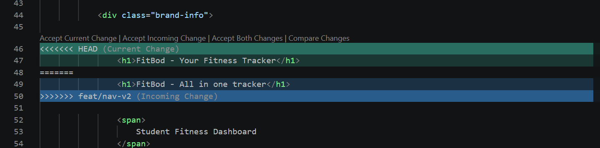
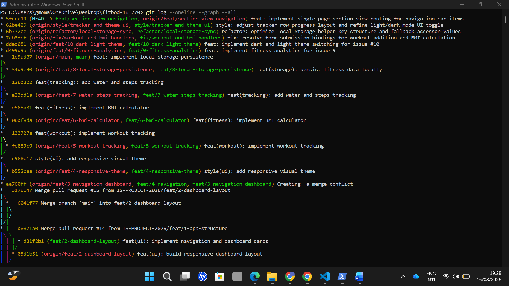
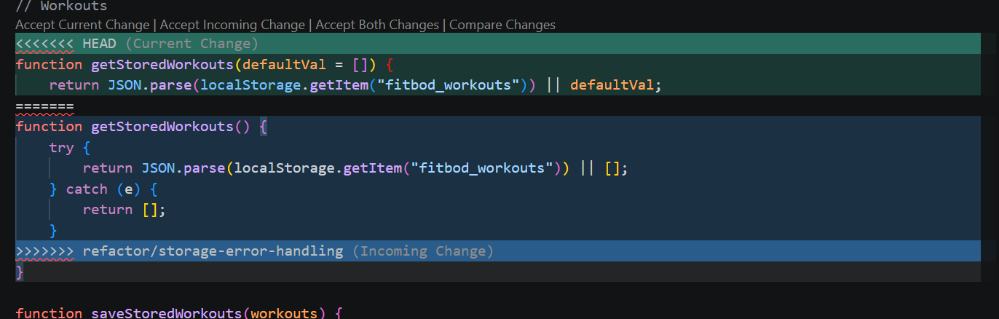
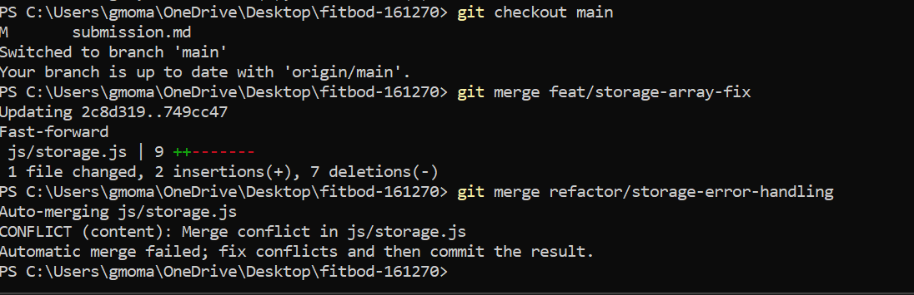
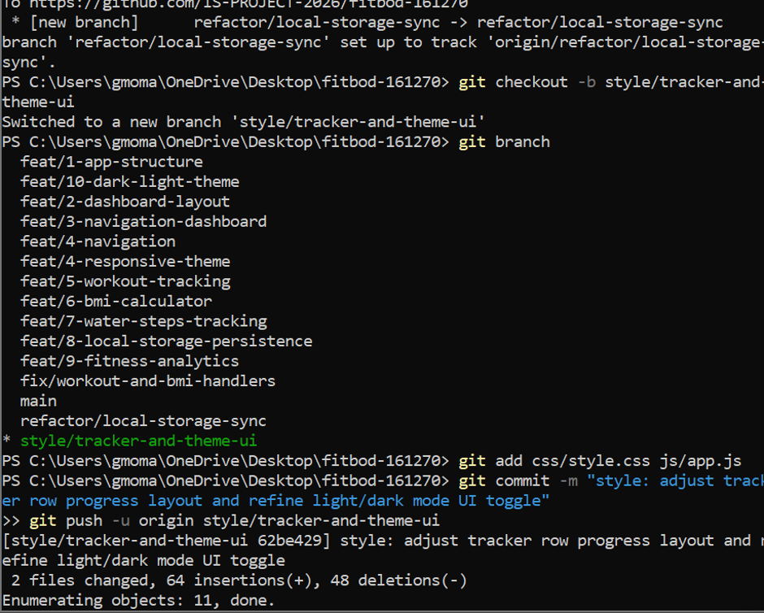

# Project Submission Report

## 1. Student Details

- **Full Name:** Ian Momanyi Omwenga
- **GitHub Username:** ian-omwenga
- **Email:** ian.omwenga@strathmore.edu

---

## 2. Deployed Project Link

- **Live GitHub Pages URL:** https://is-project-2026.github.io/fitbod-161270/

---

## 3. Reflection — Grounded in Your Git History

### A. Your Best Commit

- **Commit URL:** https://github.com/IS-PROJECT-2026/fitbod-161270/commit/1e9ad07edc2a5b35c937e7389a85f49e4666e6f6
- **Why this one?** This commit follows conventional Commit specifications by using the `feat:` scope, a clear subject line, and a detailed body outlining the specific local storage integration updates on issue #8.

### B. A Mistake or Struggle

- **Link to the evidence:** https://github.com/IS-PROJECT-2026/fitbod-161270/commit/34d9e30a487c71d51c5d2f917f3a00d3ee6c3ae7
- **What happened and how did you recover?** When attempting to check out `feat/8-local-storage-persistence`, Git threw a fatal error because the branch already existed locally. Using `git branch` I listed all active branches, and switching to the correct branch tracking `main`.

### C. A Pull Request You're Proud Of

- **PR URL:** https://github.com/IS-PROJECT-2026/fitbod-161270/commit/d499d9a648c7fdf5a8db4bd1f856fd734fd7719b
- **What did you check before merging?** I performed a manual self-review to ensure that all workout analytics helper functions handled empty state edge cases, verified `Closes #9` to close the issue in the development board.

### D. One Thing You Would Do Differently

- **What would you change?** I would enforce stricter feature branching earlier in the project instead of combining theme management and main layout into a single `app.js` file.
- **Link to the evidence of the original decision:** https://github.com/IS-PROJECT-2026/fitbod-161270/commit/2dcc1fbdd390b1156606911f9ddbed979a97e243

---

## 4. Screenshots of Key GitHub Features

### A. Milestones and Issues

Active project milestone for the FitBod Fitness Dashboard displaying the set timelines and linked tracking of issues used to monitor deliverables.

### B. Project Board

GitHub Kanban project board showing task traceability with issues organized dynamically across To Do, In Progress, and Done columns.

### C. Branching Architecture

 
Local terminal output showing feature branches named using conventional issue-linked patterns (`feat/1-app-structure`, `feat/8-local-storage-persistence`, `feat/9-fitness-analytics` etc).

### D. Pull Requests & Traceability

  
Completed Pull Request illustrating code review traceability and automatic issue resolution using keywords

---

## 5. Merge Conflict Evidence

### Conflict 1 — Full Chronology

**What cause did you use?** Simultaneous edits to the same line or concurrent modifications to the same file (index.html).

#### Step 1: Generating the Clash

The feat/nav-2 branch is being merged into main, but both branches have conflicting changes in index.html. GitHub warns that the conflicts must be resolved before the pull request can be merged.

#### Step 2: Inside the Code Editor (Conflict Markers)

Raw Git conflict markers showing conflicting navigation markup between the main branch and feature branch.

#### Step 3: Resolution & Clean Merge
 
Clean branch history after manually picking the unified navigation structure, staging `index.html`, and committing the resolution.

---

### Conflict 2 — Different Cause

- **What cause did you use?** Conflicting function declaration signatures in a shared script file (`js/storage.js`).

- **Why does this cause trigger a conflict?** Both branches introduced different signatures and default return objects for local storage accessors, causing Git to flag a conflict when merging into `main`.

*Caption:* Conflict markers in `js/storage.js` resulting from concurrent modifications to default storage getter definitions.

---

### Conflict 3 — Different Cause

- **What cause did you use?** File deletion vs. file modification (e.g., deleting a legacy script while another branch modified it).
- **Why does this cause trigger a conflict?** One branch modified a function inside `js/app.js` while a parallel refactoring branch unlinked the script, causing Git to flag the state conflict.

 
 
Git conflict warning in the terminal highlighting a delete/modify dispute on `js/app.js`.